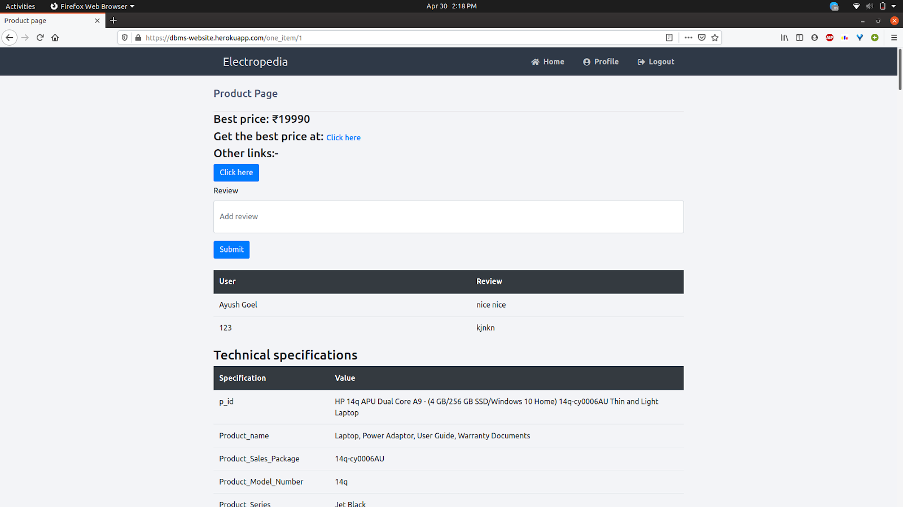

# Electropedia
UPDATE: Database is currently down.  
Visit our website at to find the cheapest price for the electronics you want!: [http://dbms-website.herokuapp.com/](http://dbms-website.herokuapp.com/)

E-shopping can get time-consuming and confusing given all the different websites that sell the same products. Inspired by this problem our project focuses on implementing a system that gives the cheapest price available for that particular product to a user taking the information from various e-commerce sites and presenting it after due comparisons.

# Usage

Simply go to [http://dbms-website.herokuapp.com/](http://dbms-website.herokuapp.com/)

# Images of Website





# Directory Structure
```
.
├── app
│   ├── main.py
│   ├── __pycache__
│   │   └── main.cpython-37.pyc
│   ├── static
│   │   └── style.css
│   └── templates
│       ├── add_product.html
│       ├── home.html
│       ├── index.html
│       ├── layout.html
│       ├── list.html
│       ├── login_store.html
│       ├── one_item.html
│       ├── profile.html
│       ├── register.html
│       └── store_portal.html
├── Pipfile
├── Pipfile.lock
├── Procfile
├── README.md
├── runtime.txt
├── TVimgsScrape.py
└── wsgi.py
```

- `app/main.py` is the Python program that is run.
- `app/templates/*` contains various webpages of the website.
- `app/static/style.css` contains the CSS template used across the website.

# Working
- Flask is used as an interface between the backend Python scripts and HTML files.
- The database is stored online on an AWS server.
- To access the database, we use embedded MySQL queries in our Python program using a MySQL connector.
- The website is hosted on the internet for free using Heroku.

# Meet the Team!
This was a team project (size 5) in DBMS course.\
The team was [Ayush Goyal](https://github.com/ayushns9), Parul Yadav, [Prabhat Soni](https://github.com/prabhatsoni99/)), Mohammed Sajeel and Nishant Grover.
